[TOC]

#Overview of IBI VizEdit 

*Matthew G. Barstead, Ph.D.*

IBI VizEdit is a program built using RShiny. It is designed to assist in the manual editing of inter-beat interval files that are derived from photoplethysmogram (PPG) recordings. Unlike the electrocardiogram signal (EKG or ECG), PPG signals are characterized by a slow-moving waveform, which presents a different set of challenges when the true signal becomes contaminated with motion artifacts and other sources of noise. 

Why a new program? Well, most heart rate editing software that exists to date was designed and optimized for the detection and editing of inter-beat interval files derived from EKG signals. IBI VizEdit provides a new suite of tools for researchers who find themselves working with messy PPG files. 

Please note that IBI VizEdit is beta software. It has not been fully tested, and there are likely numerous bugs and opportunities to optimize code and performance. Any and all feedback is welcome. 

*As of right now, IBI VizEdit is only supported for use on Windows 7/8/10 and Linux (Ubuntu 16.04).* 

Please cite as: 

Barstead, M. G. (2018). IBI VizEdit v.1.2: An RShiny Application [Computer software]. University of Maryland. doi: 10.5281/zenodo.1209474

## Program Setup

The program and all its necessary files can be found at the following [GitHub repository](https://github.com/matgbar/IBI_VizEdit). The critical files are the current version of the application itself which is `VizEdit_v1_2_3.R` (IMPORTANT: be sure not to download the file with `dev` in the filename as it is not a stable version of the program) and the folder labeled `IBI_VizEdit_stan`. This latter folder needs to be saved in your Documents folder (specifically the Documents folder associated with the specific user account logged in). 

Be sure that you are using the most current version of R and RStudio. Update both programs if necessary prior to completing any other steps in setting up the program. 

###Stan and `rstan` in IBI VizEdit

Your very first setup step is to install Stan and `rstan` onto your computer. Stan is a program external to R that allows researchers to easily and quickly implement a variety of Bayesian models.  As opposed to other Bayesian modeling software packages such as JAGS or BUGS, Stan runs its models in compiled C++.  This means that the first time a model is run the relevant Stan code will be compiled. As a result, the first imputation run will likely be a bit slower than subsequent runs. The increased speed in running a compiled program more than makes up for this minor inconvenience on the first initialization. 

Stan has an active [developer community on GitHub](https://github.com/stan-dev), and more information can be found at [mc-stan.org](http://mc-stan.org/). Detailed instructions for setting up Stan can be found [here](https://github.com/stan-dev/rstan/wiki/Installing-RStan-on-Windows). Be sure to follow the instructions precisely in order to guarantee a clean setup. 

As a reminder, the current version of IBI VizEdit is only supported on Windows 7/8/10 and Ubuntu 14.04+. The program may work on other operating systems, but there is no guarantee.  

**IMPORTANT:** The Stan program incorporated into IBI VizEdit will not run if you do not properly setup Stan and if you do not include the `IBI_VizEdit_stan` folder in your documents folder (the filepath should be `~/Documents/IBI_VizEdit_stan`). This folder is available in the IBI VizEdit repository and **must be downloaded and saved** in the correct location for the program to work. 

**IF YOU USE LINUX**: For Linux users the IBI_VizEdit_stan folder should be saved in your home directory (i.e., the path should be: `~/IBI_VizEdit_stan`). IBI VizEdit has been tested on Ubuntu 14.04+. It is not known at this stage whether other Linux distributions (e.g., Mint, Redhat) will require modified setup approaches. 

### RStudio Setup

The first time IBI VizEdit is run on a computer, it will require the installation of a number of different R packages. This occurs automatically, but it does require an Internet connection the first time IBI VizEdit is run on a new computer. 

The list of packages required by VizEdit is below:

```
shiny, 
ggplot2, 
shinythemes,
shinyFiles,
signal,
zoo,
forecast,
psych,
rtf, 
shinyBS, 
tseries, 
rstan,
rstanarm,
bayesplot,
MCMCvis, 
astsa, 
parallel,
benchmarkme,
doParallel,
imputeTS, 
seewave
```


## Preparing to Edit 

### 1. Supported File Types 

IBI VizEdit can work with any raw PPG signal that is saved as a tab-delimited `.txt` file. The PPG data should exist in a single column, though the presence of other data in other columns is not an issue. If header information exists, there is no need to remove it prior to loading the data into VizEdit. You will be presented with an opportunity to specify the number of header rows that exist before you load the raw file into the program (IBI VizEdit will discard these rows when reading in the data).

The program supports files sampled at a rate of up to 2000 Hz, and you will be presented with an opportunity to down-sample your output files should that be of interest. The current version of the program (v1.2.3) has an **overall file size limit of 150MB.**

### 2. Selecting a Working Directory

One slight downside in working with RShiny is that it can be slow in navigating a system's file structure. To help speed this process up, before you go to use IBI VizEdit, place all files you would like to edit in a specific folder. This includes the timing file (more on that below). This folder should be accessible to the specific user profile logged into the computer. When working in IBI VizEdit, you will specify this folder as your working directory, and it should be your very first step in the program (assuming you have organized all of your files accordingly). After you have selected the appropriate folder, choose the file you would like to edit. 

####  Set Working Directory: 

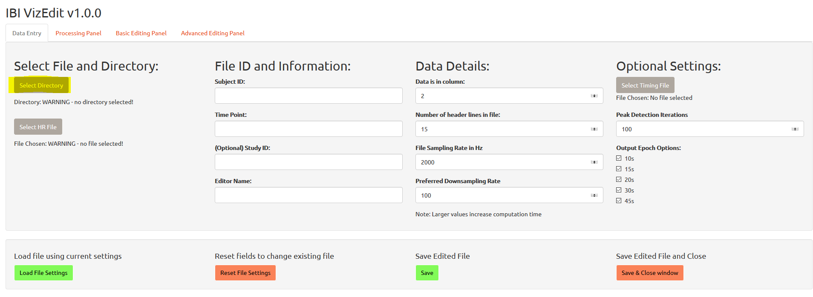

#### Select Folder: 


When you save your processed and edited files, the program will create a new output folder that will contain a `Case Processing Summary.rtf` file, a raw `.txt` file containing the downsampled version of your PPG data, a separate time series `.csv` for each epoch interval you selected on the opening screen, a overall summary `.csv` file containing heart rate and heart rate variability scores by task, both edited and raw versions of your processed IBI files (as `.txt` files), and finally, separate IBI `.txt` files separated by task (see image below).

####Output Folder Example: 


### 3. Selecting File Settings

After you have identified your working directory, the next step is to select the correct raw file. Click the `Select HR File` button just below the `Select Directory` button and choose the file you would like to edit. 

When initially loading your raw file, there are several important inputs and decisions required. First, to standardize file processing and naming, IBI VizEdit requires that files are named using the following convention: `ID#_Timepoint.txt` . The ID of the participant should be the study ID used by the researcher and the `Timepoint` can be any mix of legal filename characters that specify a study time point (e.g., T1, T2, etc), a group assignment (e.g., Tx, Crtl), or a study task or condition (e.g., Task1, Condition2, etc.). 

####Windows Explorer Example of Working Directory Files:

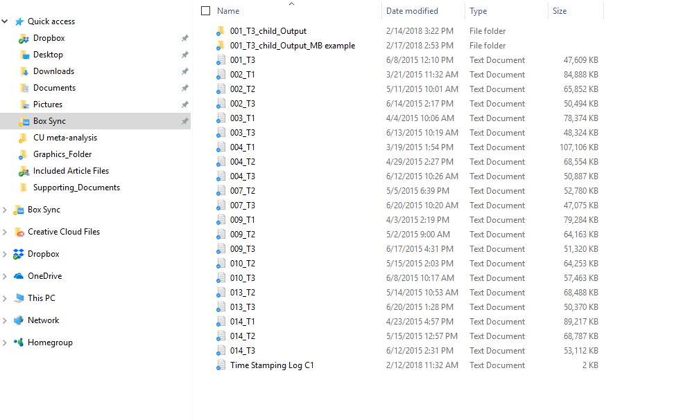

After you have input the necessary file information, you have the option of specifying an additional identifier for your output files. For instance if your raw file contains several heart rate signals from separate individuals, you may want to specify which one you are working on using this identifier (e.g., subjA, subjB, etc.). In our lab, we collect simultaneous data from parents and children and we use these fields as follows to help track our processing and cleaning efforts:

####File Information Fields:


Although it is not strictly necessary for the program to run, it is probably good habit to track who is editing each file for the purposes of determining reliability and maintaining editing integrity. 

A component that *is* necessary is a timing file, even if you don't have any tasks you want to use to separate your output. There are current workarounds if you would like to use the program, and do not have timing files or separate tasks. Contact the developer, Matthew Barstead (barstead@umd.edu) for more information. Timing files can be created in excel or any other general spreadsheet software, but should be converted to tab-delimited `.txt` files before attempting to load them into IBI VizEdit. 

 #### Timing File Example: 


Note that a key feature of the timing file is the inclusion is `File Name` column. It should have the exact two values that were input in the `Subject ID` and `Time Point` fields separated by a `_`. If the file name for the raw data does not match the values in the timing file, or those input by the researcher, IBI VizEdit will return an error. 

####Example ID Missing Warning: 


Once all of the files are loaded, you should specify the column in the PPG data file with the relevant channel, the number of header rows (if any), the sampling rate of the original file, and the downsampling rate of the final file. Also be sure to select the number of different epoch lengths you would like to see in the timeseries data files created by the program (the default is to output all options). 

After you have specified all of the mandatory and optional information on the opening screen, click the green `Load File Settings` button located in the bottom left of the browser window. If everything goes according to plan, the directory and files will load and you will see their system paths displayed beneath them as in the example below: 

#### When Loading Works


Once uploaded, folder and file information will populate (see image above) in the window - providing a visual indication that your data is ready for the next processing step. If you are working with particularly large files, you may need to be patient as the program loads the data. Additionally, if everything has loaded correctly, when you navigate to the `Processing Panel` you will see the timing information for the specifc file displayed on the right side of the window.

#### Timing Information in IBI VizEdit


## Processing Your File

Once you have loaded the various settings for the program, your next task is to process the PPG file and identify the peaks. First, use the View Plot button on the second panel to ensure that the data has loaded correctly. 

#### Checking Your Data


If you are satisfied that you correctly loaded in your heart rate data, click the "Process File" button. The peak detection algorithm will iteratively identify an optimal processing bandwidth and return a raw inter-beat interval file. A tracker will appear in the bottom right notifying you of the program's progress

#### Peak Detection Algorithm Tracker


The processing summary will populate in the `Processing Panel` when the algorithm is complete. The same table will be included in the `Case_Processing_Summary.rtf` output when you have finished editing your file.

#### Peak Detection Summary Table


Once this step is complete, you should be able to move on to the `Basic Editing Panel` . There you will find two graphs initially. The first and largest graph is the complete IBI file for the entire target window (i.e., start of the first task through the end of the last task). The second, smaller graph is the PPG file in its entirety for the same period. Vertical, colored bars mark the start and end of each task or segment of the file, based on what is defined in the timing file. 

#### Basic Editing Panel Example: 

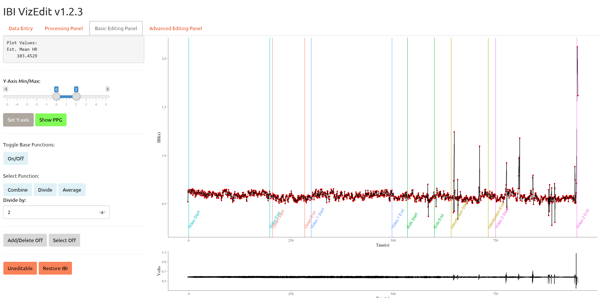

In order to begin inspection a section in more detail, highlight a section of the file to examine by clicking and dragging your cursor over an area on the smaller PPG graph. 

#### Selection a Section to Edit: 


Note that the IBI values and the PPG signal are likely to be on different scales. You can use the `PPG Zoom Function:` to change the scaling of the PPG waveform. We have found that for initial edits with child data, a first pass at a range of 0 to 2 on the y-axis, followed by a second pass using a 0 to 1 range is generally useful. There is some individual variability in heart rate timing, and depending on the conditions individuals are exposed to (e.g., at risk vs. active) appropriate scales for visual editing may vary. 

When zoomed in, I also have the option of viewing the PPG waveform that underlies the detected IBIs by selecting the `Show PPG` button (see below) 

#### Viewing PPG Signal

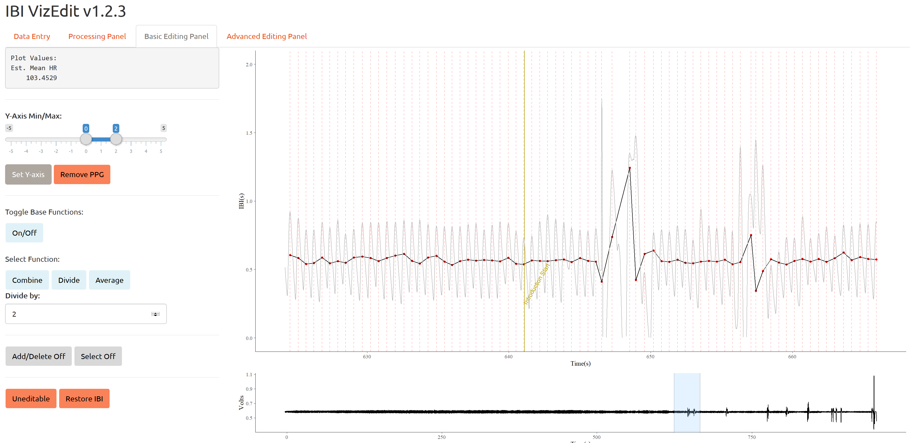

You may have to adjust the scale on the y-axis as not all signals will easily fit on the 0-2 range (though this case obviously did). For optimal performance, keep the PPG signal 'turned off' as you scroll through the file looking for potential areas that require editing (*Note:* displaying the PPG waveform does not affect performance too much on computers with high quality graphics cards)


## Editing Your File: The Base Functions 

There are two different editing panels in IBI VizEdit. The specific portion of the file you decide to view and edit on either the "Basic" or the "Advanced" panel is controlled by the small horizontal graph at the bottom of the "Basic Editing Panel" (see image above in previous section).  Simply use your mouse to highlight a section of the overall file and VizEdit will display that portion of the file in visual editing interface on both panels.

The basic panel allows you to perform several simple functions. 

1. **ADD** a peak with a single click at the exact point (referenced to the x-axis) you believe a beat should have been identified. 
2. **DELETE** incorrectly identified points. 
3. **COMBINE** two or more inter-beat intervals that were incorrectly identified by the peak detection algorithm. 
4. **DIVIDE** a point where the peak detection program 'skipped' over the identification of previous heart beats. (Note this is particularly useful when the underlying signal is messy and you cannot identify a specific peak nearby)
5. **AVERAGE** nearby IBIs when there are issues with peak detections. (Note this is a helpful tool when the signal, for one reason or another includes two peaks much closer together or farther apart than the surrounding data) 

###ADD

Begin by making sure you have the `Add/Delete` button turned on (click on the button - note that the `Select` button needs to be turned off before you can turn this feature on). 

This feature is best used when it is clear that the peak detection algorithm failed to correctly identify a peak at a valid location (*Note*: the example below is a toy example - the peak detection algorithm would correctly identify the missing peak). 

*Missed Peak Example*

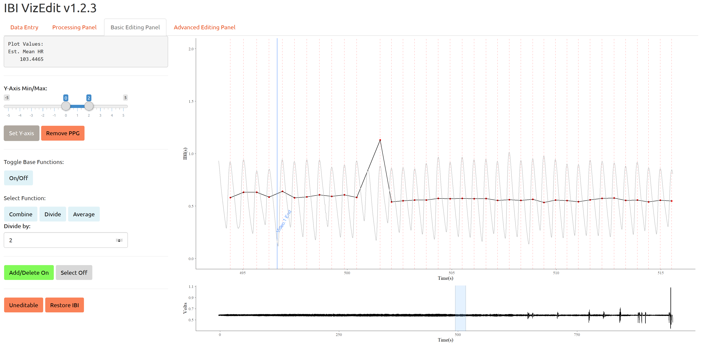

To add a point, move your cursor directly over the peak on the PPG signal and left-click your mouse a single time. 

*Missed Peak Added to the IBI File*

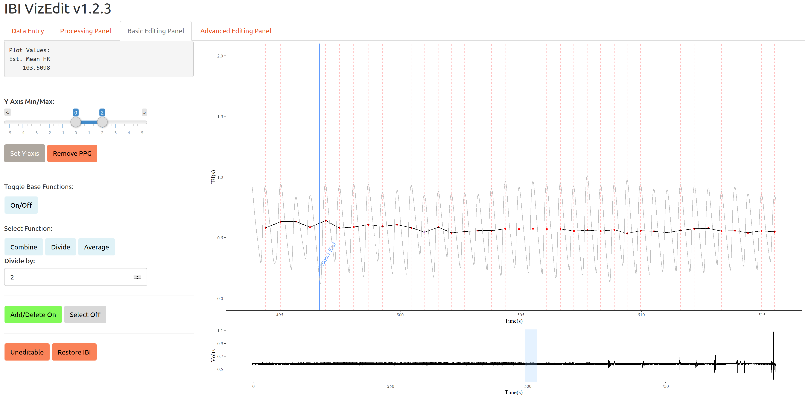

Though perhaps difficult to tell in the above image, the new point is now purple - an indication that it is an edited (i.e., not original value). This allows the researcher to visually track where edits have been made in the file. 

An alternative choice for this edit may have been to divide the large IBI value in 2. However, since we can see exactly where the peak should have been, there is no need for us to artificially reduce variability in the data by using the divide function. 

###DELETE

If you believe that the peak detection algorithm has incorrectly identified a heart beat, you can delete that value. Oftentimes after deleting a value additional editing steps will need to be taken (e.g., average or dividing). 

*Example of (Potentially) Misidentified Peak*

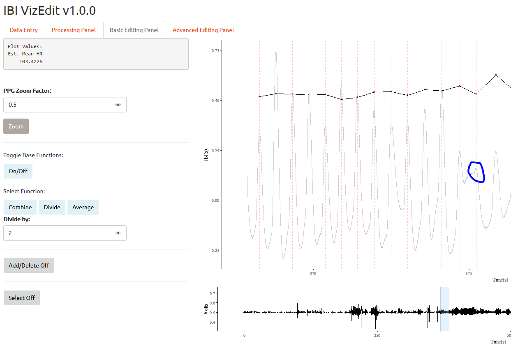

To use the delete function, turn on the `Add/Delete` button, move your cursor above the IBI value associated with the misidentified peak and double-click. The point will be removed from the IBI file. As previously noted, however, you may need to make additional edits. (Note the `Add/Delete` function is particularly useful when using the advanced editing panel). 

*Example of Deleted IBI*

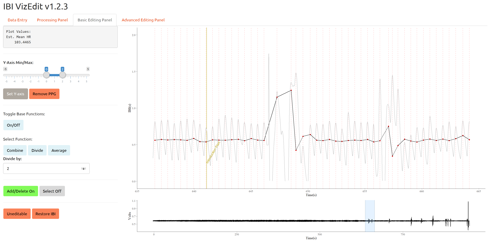

As noted above, you will likely still need to make additional edits in this case (dividing the resulting large IBI in 2 seems appropriate in this case). Also note that deleting a single point is equivalent to combining it with the next IBI value (see `Combine` function for additional details). 

###COMBINE

Building from the `Delete` use case example, the same edit could have been achieved using the combine function. To use the `Combine` function turn the `Select` button to the 'On' position by clicking it once (*Note*: the `Add/Delete` button must be set to the 'Off' position). You will also need to turn on the `Base` editing functions, which will turn a darker shade of blue when activated (see below)

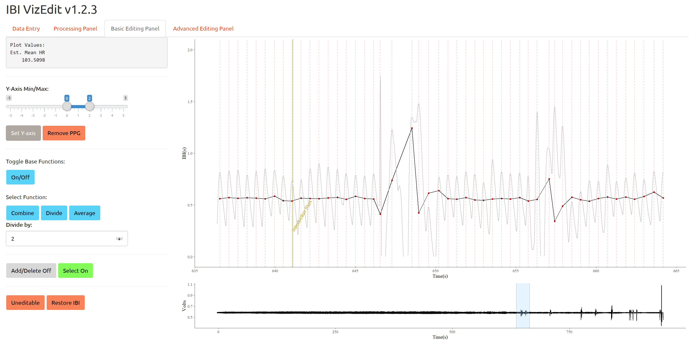

Once you have the program correctly setup to use the base editing functions, highlight the points you would like to combine. Make sure that selected points have turned green (see below).

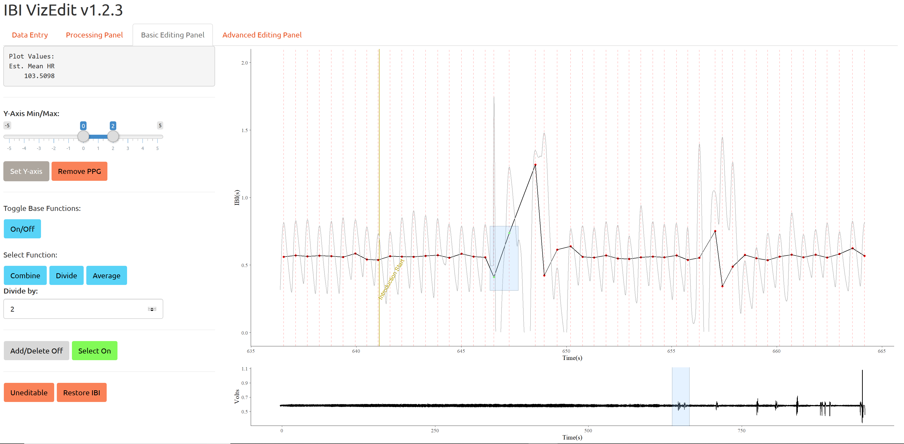

Then hit combine and the two IBI values will be added together. Compare these results with the results of using the `Delete` function to remove this incorrect data point. 

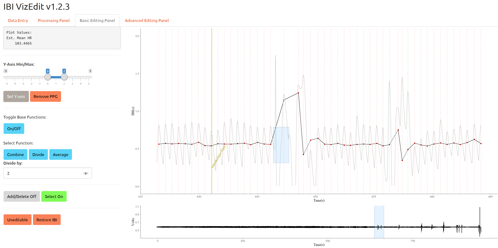

###DIVIDE

The divide function is useful when you cannot add a point manually but you can clearly tell that one or more heartbeats were missed. Usually this occurs when the signal near the correctly identified peaks is corrupted. 

Continuing with the section of data used in the `Delete` and `Combine` use case scenarios, it is clear that using either one of those functions alone will not be sufficient to address the problems with the signal and resulting IBIs. 

To divide an IBI, select the relevant data point, make sure it has turned green (an indication that you have successfully selected the point for editing) and divide the point by an appropriate integer. In this case, given the surrounding values (*Note*: to see a specific IBI value, hover the cursor over that point), dividing by two is appropriate. 


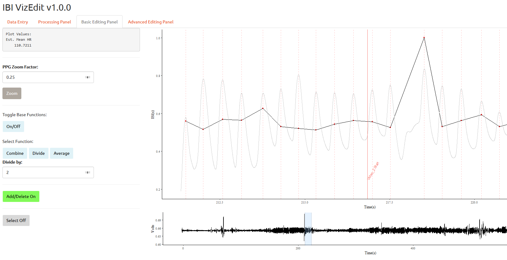

Hitting `Divide` results in the following 2 points, both of which are more in line with the surrounding data. 

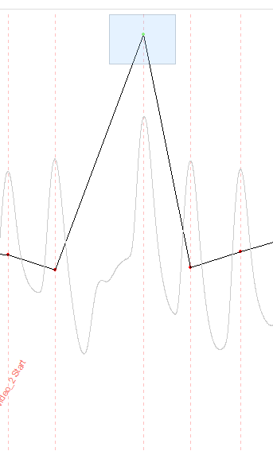

###AVERAGE

Sometimes there can be odd delays in the signal between heart beats. These can be the result of naturally occurring arrhythmias or as a function of some combination of movement and/or blood flow that is not directly tied to cardiac output. Typically, the underlying heart rate signal will take on a slightly different wave form when this happens, and the average function can be a useful way to bring the resulting IBIs more in-line with surrounding values. 

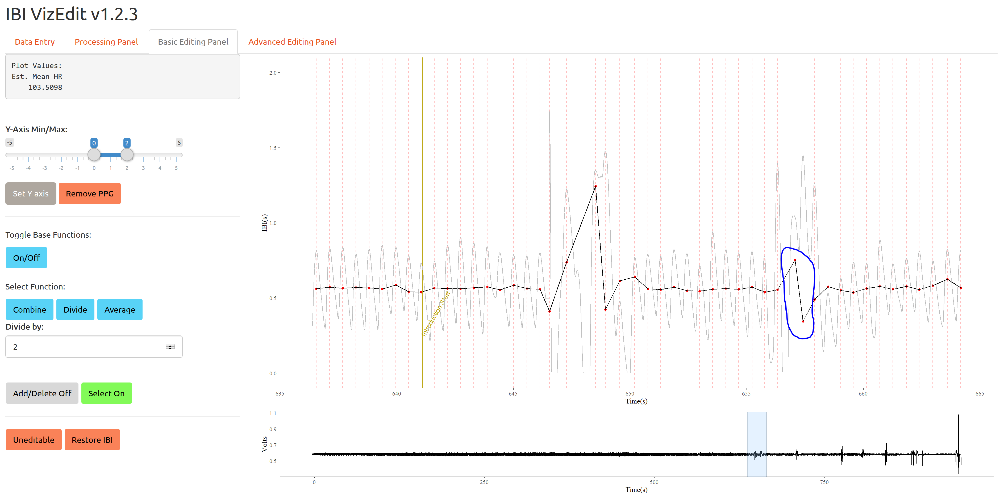

To average these points, begin by selecting both, again making sure that you wait until the points turn green before hitting the `Average` button. 

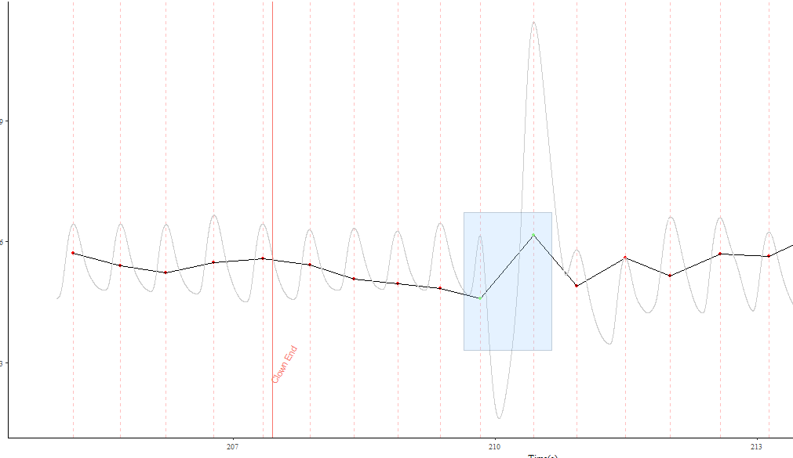

And the averaged results of these two points is displayed below

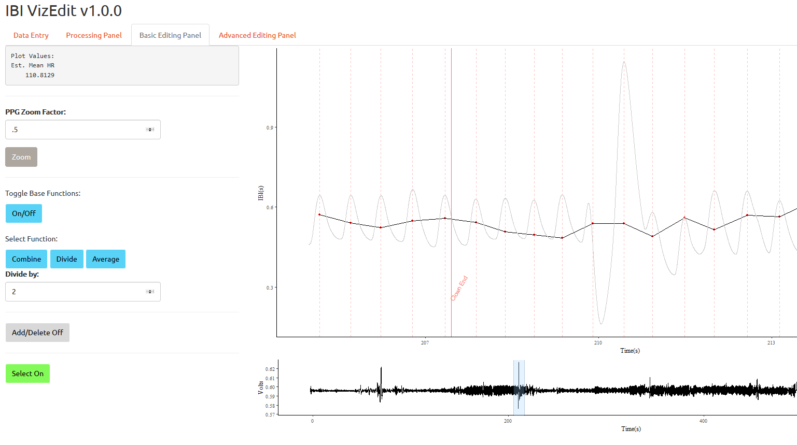


### ADVANCED EDITING PANEL

The advanced panel offers a new suite of data imputation techniques that, as of yet, have not been included in previous heart rate editing packages. Chief among these techniques is the incorporation of Gaussian process models. 

Gaussian process models are incredibly flexible, albeit computationally demanding. In IBI VizEdit, data imputation via Gaussian process models is implemented using Stan with R's Stan interface package `rstan`. Use of this feature requires separate installation of Stan and `rstan` (for more information [visit this site](https://github.com/stan-dev/rstan/wiki/RStan-Getting-Started)).  

Imputation run times will vary as a function of the downsampling rate, the size of your file, the amount of time that requires imputation, and the consistency of the surrounding data. See below for more information about how Gaussian process models are implemented in IBI VizEdit. 

## What is in Your Output

Once you have finished editing your document and you have selected the "Save" button on the main panel, a separate output directory will be created in your working directory folder that includes: 

1. `ID#_Optional(ID)_Timepoint_Case_Processing_Summary.rtf`: This file includes summary information about the your file and editing choices: 
2. - The output of the peak detection algorithm and the final bandwidth used for identifying peaks. 
   - Average heart period and heart rate variability for the entire file as well as split by task/condition. 
   - An editing summary that identifies every edited point that remains in the final file, including the value of the edited IBI, the time point of the edit, and the type of edit made. 
   - A summary of the results from each Gaussian Process used to impute data, including the final output for parameters estimated by the models.


2. `ID#_Optional(ID)_Timepoint_Hz_PPG.txt`: The downsampled file of the original signal. 
3. `ID#_Optional(ID)_Timepoint_raw_IBI.txt`: The unedited version of the original IBI file as produced by the peak detection algorithm. 
4. `ID#_Optional(ID)_Timepoint_Xs_Epochs.csv`: A time series file with summary statistics computed for heart period (HP), root mean square of successive differences (rmssd), and standard deviation (sd) by user-specified epoch length. If the researcher selects multiple epoch lengths when setting up the editing session, multiple separate files will be included in the output. 
5. `ID#_Optional(ID)_Timepoint_edited_IBI.txt`: The complete edited file. Edited IBI files are also output by by task. 
6. `ID#_Optional(ID)_Timepoint_edited_Task.csv`: Summary values (e.g., HP, rmssd, and sd) separated out by task/condition.  

Additional output related to each Gaussian Process imputation model as well as files pre-formatted to work with CardioBatch, a program used to calculate repiratory sinus arrhythmia scores using Porges' moving polynomial algorithm (note this software is not open-source), is stored in separate folders within the output folder.

## Gaussian Process Modeling

Perhaps the most novel feature included in IBI VizEdit is a mechanism for simulating heart rate data in instances when a messy signal has made it nearly impossible to correctly identify multiple consecutive IBI values. In the past, an editor would usually have to combine, divide, and average his or her way through such sections, largely reducing variability along the way. With Gaussian process modeling, it is now possible to simulate data based on the surrounding valid signal. The current model for imputation is specified using the following covariance functions (interested readers with knowledge of Gaussian process models can review the Stan code for more detail): 

The first Gaussian process in the model is specified as follows:
$$
g_1 \sim N(0, k_1)
$$
with a squared exponential covariance function to model a general decline in the covariance between two points as a function of time, 
$$
k_1(t, t') = \sigma_1^2exp\Big(-\frac{(t-t')^2}{2l_1^2}\Big)
$$


The second Gaussian process process is specified as follows: 
$$
g_2 \sim N(0, k_2)
$$
with a periodic covariance function that is allowed to decay with time, 
$$
k_2(t, t') = \sigma_2^2exp\Big(-\frac{2sin^2(\pi(t-t')f_{HR}}{l_2^2} \Big)exp\Big(-\frac{(t-t')^2}{2l_3^2}\Big)
$$
where $f_{HR}$ is heart-rate frequency (which needs to be given a range by the user - more on that below). 


The third Gaussian process is specified as follows: 
$$
g_3 \sim N(0, k_3)
$$
with a periodic covariance function for heart rate that varies as a function of the individual's average estimated respiration rate. Respiration rate is modeled within the Gaussian process and given a prior distribution using spectral density within the frequency of domain of normal respiration. The spectral density is estimated from the entire file. 
$$
k_3(t, t') = \sigma_3^2exp\Big(-\frac{2sin^2(\pi(t-t')f_{HR}}{l_4^2}\Big)exp\Big(-\frac{2sin^2(\pi(t-t')f_{R}}{l_5^2}\Big)
$$
where $f_R$ is respiration frequency. 


Finally, the fourth Gaussian process is specified as follows: 
$$
g_4 \sim N(0, k_4)
$$
with a periodic covariance function for heart rate that allows for heart rate variability in the low frequency domain. A static value of .1 Hz is used to partially control the decay rate (as opposed to specify a strong prior as is the case for respiration above).
$$
k_4(t, t') = \sigma_4^2exp\Big(-\frac{2sin^2(\pi(t-t')f_{HR}}{l_6^2}\Big)exp\Big(-\frac{2sin^2(\pi(t-t')(.1)}{l_7^2}\Big)
$$
More details regarding the specific implementation can be obtained using the 

### Using the Bayesian GP imputation - A Simple Example

Bayesian GP is most useful and most appropriate when a number of IBI values are affected by a section of bad signal, and obvious editing strategies fail to offer easy solutions that reasonably bring data back in line with surrounding "good" signal. 


**IMPORTANT: Current pilot work (as of VizEdit v1.2.0) indicates that windows over 10 seconds may not produce particularly stable imputation results.**  

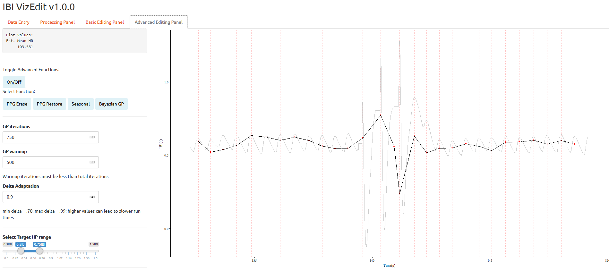

In order to ensure a successful Bayesian GP run you need to take the following steps. 

1. Your target imputation window requires "good" signal to be present on both sides (i.e., before and after the desired imputation window). As of VizEdit v1.2.3, the editor can view the region of signal that will be used to impute the corrupted values, highlighted in green. If there are sections of data that are not suitable for use in the data that will be used for imputation, the user will need to remove these sections using the `PPG Erase` function (highlight the problematic area - being careful to retain as much good signal as possible and click `PPG Erase`).

   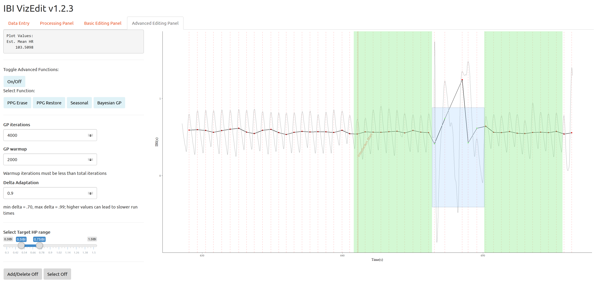

2. Identify the minimum IBI value in the surrounding signal (highlighted in green) that you are confident is a validly identified IBI value. Use the slider to set the minimum Target HP value to the identified minimum IBI value - .02 (round if necessary). 

3. Identify the maximum IBI value in the surrounding signal that you are confident is a validly identified IBI value. Use the slider to set the maximum Target HP value to the identified maximum IBI value + .02 (round if necessary).

*Setting Slider Values*

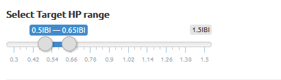

4. Turn on the Advanced Functions (note that you will not be able to do so if the Base Functions remain on from the Basic Editing Panel). 
5. Turn the `Select` button on and be sure you have included all values that differ from the surrounding signal. It is best to highlight an area from valid trough to valid trough (see below):


Note that the *selection box only needs to include correct values for the target segment along the x-axis and that it does not need to extend vertically to cover complete set of values along the PPG line*. 

6. When you are ready, click the `Bayesian GP` button and wait for the program to run. You can track progress in your RStudio Window (though the Stan developers are working on it, there currently is not an easy way to track estimated time for model runs). *To speed up the run time ensure that you do not have any other programs open that require a large amount of processing power.* 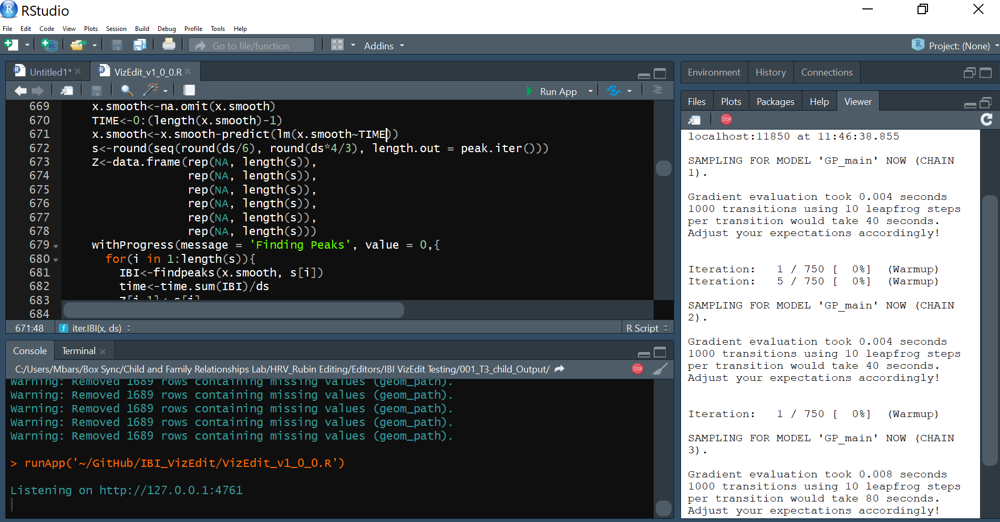

Note that you can refresh the Viewer to update the model progress (Windows only - chain updates will appear in the console for Linux distributions). When finished a light blue line representing the imputed data will appear (see below).

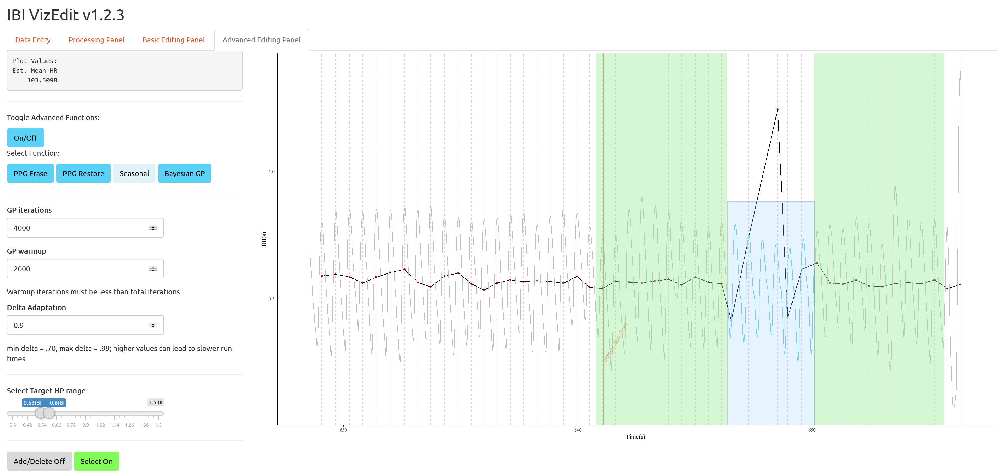

7. Following the imputation run click anywhere on the editing window outside the selection box and then turn the `Selection` function off to remove the selection box.
8. Turn on the `Add/Delete` function and begin manually adding points at the newly identified peaks. To add a point click once with the left button of your mouse at the desired location on the imputed waveform. To delete peaks double-left-click directly over the incorrect IBI value. 

This imputation run results in the following IBI series: 


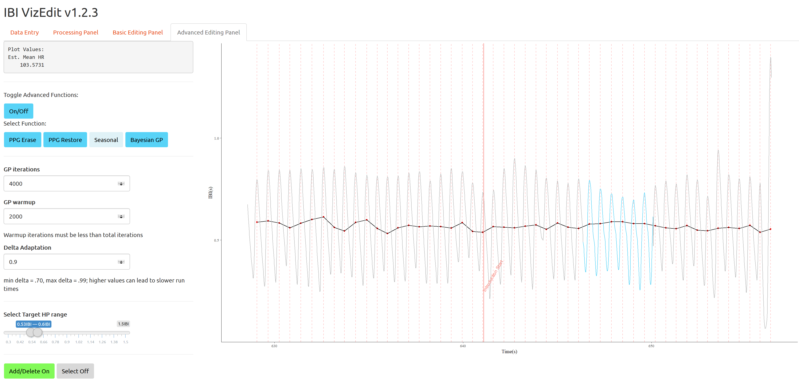

### Using Bayesian Imputation - A More Complicated Example

In the first example, the section of corrupted data was surrounded by good signal for at least 1.5x the length of the imputation window on either side of that window (i.e., before AND after). That may not always be the case. When you do have concerns about the signal quality that is going to be utilized in the imputation, you need to first prep the area before performing the analysis. To do this you will "erase" sections of bad signal you do not want incorporated in your Bayesian GP model. 

In the plot below, say I wanted to use the Bayesian GP function to impute data for the corrupted signal in the highlighted section (note this is an example only - averaging these data points would be a viable and less time-consuming editing strategy). There is clearly an area to the right that is within five seconds of this window and includes portions of distorted signal. 

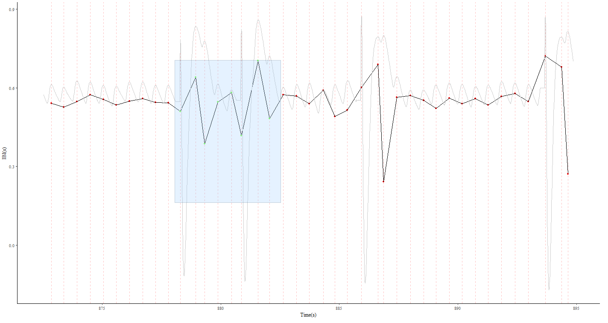

To ensure this corrupted data is not used to simulate and impute "good" data, it needs to be removed using the following steps: 

1. Highlight the area targeted for removal as you would if you were going to impute data in that section. 

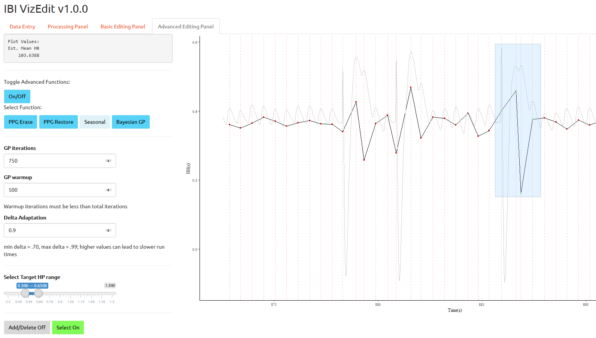

2. Click the `PPG Erase` button and the segment of data should disappear from this graph (Note this requires that the `Select` button function is turned on). 

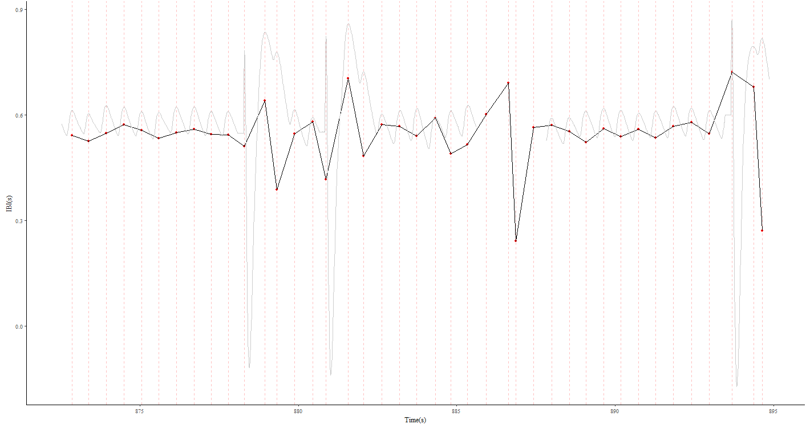

3. Run the Bayesian GP as normal (i.e., follow the steps outlined above)

Here are the results of the imputation - after 'cleaning' nearby data:

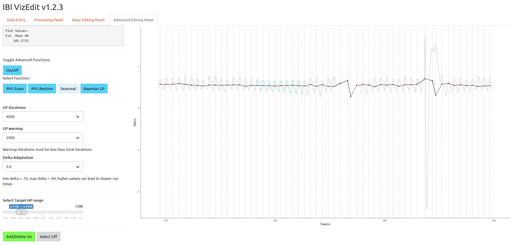


## Reporting Bugs in IBI VizEdit

IBI VizEdit is open source, meaning that individuals have the ability to adjust the code to their liking should they want to customize certain features or change default settings to better align with their own lab's data. The developer, Matthew Barstead (contact: mbarstead@gmail.com), is happy to consult in these sorts of customizations, but is not responsible for the integrity of the program should others choose to change underlying aspects of the code. In short, bugs that result from user changes will not be addressed on the GitHub Issues reporting page in these instances. 

That being said, problems with the program are almost certain to arise as its use expands to new labs with differently formatted data. For users of the main program, as released in its original form, these issues should be submitted using the GitHub Issue tracker (https://github.com/matgbar/IBI_VizEdit/issues). To aid in addressing any problems that do arise in a timely fashion please ensure that your provide a precise description of the problem, including any actions you had recently taken that preceded the crash. 

Oftentimes in the RStudio console window, you will see a warning displayed, which often contains very useful information in terms of identifying the source of the problem (see below).

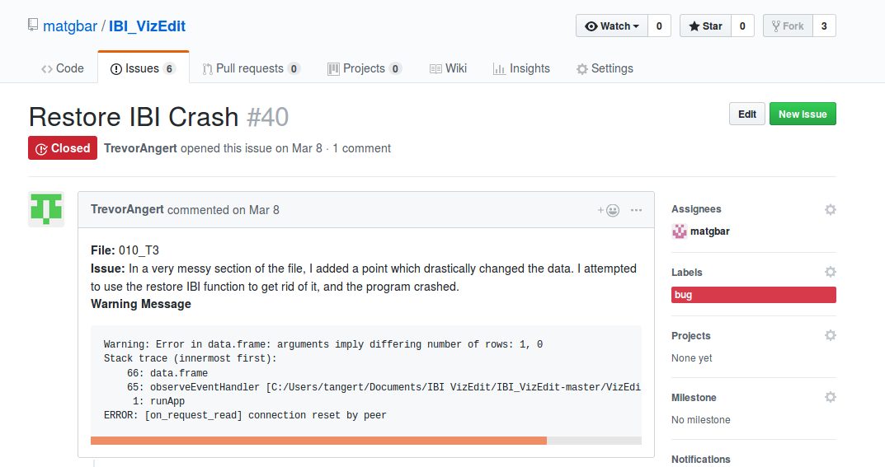

To render as code within the Issue tracking system (makes the information much more readable), begin by copying the relevant text from RStudio's console window. Then, with a new issue open (complete with an appropriately descriptive title) paste the text with ``` above and below the new text (see image below). 

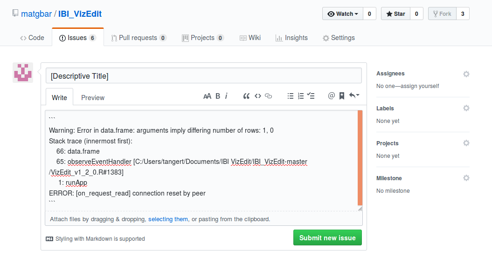

Finally, the issue tracker built into GitHub, can handle images and files, which depending on the nature of problem may be even more relevant to fixing the underlying bug. Just remember that more information is always better than less when trying debug a program remotely. 