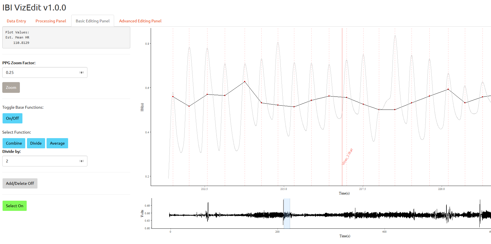

#Overview of IBI VizEdit

IBI VizEdit is a program built using RShiny. It is designed to assist in the manual editing of inter-beat interval files that are derived from photoplethysmogram (PPG) recordings. Unlike the electrocardiogram signal (EKG or ECG), PPG signals are characterized by a slow-moving waveform, which presents a different set of challenges when the true signal becomes contaminated with motion artefacts and other sources of noise. 

Though increasingly popular due to their ease of use, most heart rate editing software that exists to date was designed and optimized for the detection and editing of inter-beat interval files derived from EKG signals. IBI VizEdit provides a new suite of tools for researchers who find themselves working with messy PPG files. 

Please note that IBI VizEdit is beta software. It has not been fully tested, and there are likely numerous bugs and opportunities to optimize code and performance. Any and all feedback is welcome. 

*As of right now, IBI VizEdit is only supported for use on Windows 7/8/10.* 

Please cite as: 

Barstead, M. G. (2018). IBI VizEdit v.1.0: An RShiny Application [Computer software]. University of Maryland.

## Program Setup

The program and all its necessary files can be found at the following [GitHub repository](https://github.com/matgbar/IBI_VizEdit). The critical files are the application itself which is `.R` in the main set of files and the folder labeled `IBI_VizEdit_stan`. This latter folder needs to be saved in your Documents (specifically the Documents folder associated with the specific user account logged in). 

Be sure that you are using the most current version of R and RStudio. Update both programs if necessary prior to completing any other steps in setting up the program. 

###Stan and `rstan` in IBI VizEdit

Your very first setup step is to install Stan and `rstan` onto your computer. Stan is a program external to R that allows researchers to easily and quickly implement a variety of Bayesian models.  As opposed to other Bayesian modeling software packages such as JAGS or BUGS, Stan runs its models in compiled C++.  This means that the first time a model is run and (requiring the relevant Stan program is compiled) can be a bit slower than subsequent runs. The increased speed in running a compiled program more than makes up for this minor inconvenience. 

Stan has an active [developer community on GitHub](https://github.com/stan-dev), and more information can be found at [mc-stan.org](http://mc-stan.org/). Its incorporation into IBI VizEdit does require some additional setup, however. Detailed instructions for setting up Stan can be found [here](https://github.com/stan-dev/rstan/wiki/Installing-RStan-on-Windows). Be sure to follow the instructions precisely in order to guarantee a clean setup. 

As a reminder, the current version of IBI VizEdit is only supported on Windows 7/8/10. 

**IMPORTANT:** The Stan program incorporated into IBI VizEdit will not run if you do not properly setup Stan and if you do not include the `IBI_VizEdit_stan` folder in your documents folder (the filepath should be `~/Documents/IBI_VizEdit_stan`). This folder is available in the IBI VizEdit repository and must be downloaded and saved in the correct location for the program to work. 

### RStudio Setup

Before you run IBI VizEdit for the first time copy and paste the following line of code into your computer (you will need to be connected to the internet for this to work): 

```R
install.packages('pacman')
```

Once installed you can run IBI VizEdit. The first time you run the program will take some time as RStudio will likely need to fetch and install a number of dependent libraries IBI VizEdit requires to run properly. 

## Preparing to Edit 

### 1. Supported File Types 

IBI VizEdit can work with any raw PPG (or even EKG) signal that is saved as a tab-delimited `.txt` file. The PPG data should exist in a single column, though the presence of other data in other columns is not an issue. If header information exists, there is no need to remove it prior to loading the data into VizEdit. You will be presented with an oppotunity to specify the number of header rows that exist before you load the raw file into the program (IBI VizEdit will discard these rows when reading in the data).

The program supports files sampled at a rate of up to 2000 Hz, though it is **strongly** recommended that you make use of the downsampling feature within IBI VizEdit to reduce the file size and overall computation time. You will definitely notice the difference in speed when attempting to use any of the advanced imputation features. You may also find some of the graphics slow to refresh when using even the basic features if raw files are particularly large. The current version of the program (v1.0) has an **overall file size limit of 150MB.**

### 2. Selecting a Working Directory

One slight downside in working with RShiny is that it can be slow in navigating a system's file structure. To help speed this process up, before you go to use IBI VizEdit, place all files you would like to edit in a specific folder. This includes the timing file (more on that below). This folder should be accessible to the specific user profile logged into the computer. When working in IBI VizEdit, you will specify this folder as your working directory, and it should be your very first step in the program (assuming you have organized all of your files accordingly). After you have selected the appropriate folder, choose the file you would like to edit. 

####  Set Working Directory: 


#### Select Folder: 


When you save your processed and edited files, the program will create a new output folder that will contain a `Case Processing Summary.rtf` file, a raw `.txt` file containing the downsampled version of your PPG data, a separate time series `.csv` for each epoch interval you selected on the opening screen, a overall summary `.csv` file containing heart rate and heart rate variability scores by task, both edited and raw versions of your processed IBI files (as `.txt` files), and finally, separate IBI `.txt` files separated by task (see image below).

####Output Folder Example: 


### 3. Selecting File Settings

After you have identified your working directory, the next step is to select the correct raw file. Click the `Select HR File` button just below the `Select Directory` button and choose the file you would like to edit. 

When initially loading your raw file, there are several important inputs and decisions required. First, to standardize file processing and naming, IBI VizEdit requires that files are named using the following convention: `ID#_Timepoint.txt` . The ID of the participant should be the study ID used by the researcher and the `Timepoint` can be any mix of legal filename characters that specify a study time point (e.g., T1, T2, etc), a group assignment (e.g., Tx, Crtl), or a study task or condition (e.g., Task1, Condition2, etc.). 

####Windows Explorer Example of Working Directory Files:


After you have input the necessary file information, you have the option of specifying an additional identifier for your output files. For instance if your raw file contains several heart rate signals from separate individuals, you may want to specify which one you are working on using this identifier (e.g., subjA, subjB, etc.). In our lab, we collect simultaneous data from parents and children and we use these fields as follows to help track our processing and cleaning efforts:

####File Information Fields:


Although it is not strictly necessary for the program to run, it is probably good habit to track who is editing each file for the purposes of determining reliability and maintaining editing integrity. 

A component that *is* necessary is a timing file, even if you don't have any tasks you want to use to separate your output. Absent any meaningful timing files, the researcher should create a timing file with a column of 0's and a column total with rows indexed by the ID names of the files. Timing files can be created in excel or any other general spreadsheet software, but should be converted to tab-delimited `.txt` files before attempting to load them into IBI VizEdit. 

 #### Timing File Example: 


Note that a key feature of the timing file is the inclusion is `File Name` column. It should have the exact two values that were input in the `Subject ID` and `Time Point` fields separated by a `_`. If the file name for the raw data does not match the values in the timing file, or those input by the researcher, IBI VizEdit will return an error. 

####Example ID Missing Warning: 


Once all of the files are loaded, you should specify the column in the PPG data file with the relevant channel, the number of header rows (if any), the sampling rate of the original file, and the downsampling rate of the final file. Also be sure to select the number of different epoch lengths you would like to see in the timeseries data files created by the program (the default is to output all options). 

After you have specified all of the mandatory and optional information on the opening screen, click the green `Load File Settings` located in the bottom left of the browser window. If everything goes according to plan, the directory and files will load and you will see their system paths displayed beneath them as in the example below: 

#### When Loading Works


Additionally, if everything has loaded correctly, when you navigate to the `Processing Panel` you will see the timing information for the specifc file displayed on the right side of the window. 

#### Timing Information in IBI VizEdit


## Processing Your File

Once you have loaded the various settings for the program, your next task is to process the PPG file and identify the peaks. First, use the View Plot button on the second panel to ensure that the data has loaded correctly. 

#### Checking Your Data


If you are satisfied that you have the right file loaded, click the "Process File" button. The peak detection algorithm will iteratively identify an optimal processing bandwidth and return a raw interbeat interval file. A tracker will appear in the bottom right notifying you of the program's progress

#### Peak Detection Algorithm Tracker


The processing summary will populate in the `Processing Panel` when the algorithm is complete. The same table will be included in the `Case_Processing_Summary.rtf` output when you have finished editing your file.

#### Peak Detection Summary Table


Once this step is complete, you should be able to move on to the `Basic Editing Panel` . There you will find two graphs initially. The first and largest graph is the complete IBI file for the entire target window (i.e., start of the first task through the end of the last task). The second, smaller graph is the PPG file in its entirety for the same period. Vertical, colored bars mark the start and end of each task or segment of the file, based on what is defined in the timing file. 

#### Basic Editing Panel Example: 


In order to begin inspection a section in more detail, highlight a section of the file to examine by clicking and dragging your cursor over an area on the smaller PPG graph. 

#### Selection a Section to Edit: 


Note that the IBI values and the PPG signal are likely to be on different scales. You can use the `PPG Zoom Function:` to change the scaling of the PPG waveform. Using this function will also center the PPG wave near the IBI time series. I choose to rescale, and slightly reduce the amplitude of the PPG wave form relative to the IBI values in the example below (note this rescaling does not alter the location of local maxima used to identify interbeat intervals, just their relative values). 

####Rescaling PPG Signal Example 


As intra-individual PPG amplitudes may change over the course of an observation, you may need to rescale the PPG waveform several times during a single editing session. Any value over 1 will increase the relative amplitude of the PPG signal, any value below 1 will decrease the relative amplitude. Currently, a 10X increase is the maximum. 

## Editing Your File: The Base Functions 

There are two different editing panels in IBI VizEdit. The specific portion of the file you decide to view and edit on either the "Basic" or the "Advanced" panel is controlled by the small horizontal graphic at the bottom of the "Basic Editing Panel" (see image above in previous section).  Simply use your mouse to highlight a section of the overall file and VizEdit will display that portion of the file in visual editing interface on both panels.

The basic panel allows you to perform several simple functions. 

1. **ADD** a peak with a single click at the exact point (referenced to the x-axis) you believe a beat should have been identified. 
2. **DELETE** incorrectly identified points. 
3. **COMBINE** two or more interbeat intervals that were incorrectly identified by the peak detection algorithm. 
4. **DIVIDE** a point where the peak detection program "skipped" over the identification of previous heart rate points. (Note this is particularly useful when the underlying signal is messy and you cannot identify a specific peak nearby)
5. **AVERAGE** nearby IBIs when there are issues with detection peak detections. (Note this is a helpful tool when the signal, for one reason or another includes two peaks much closer together than the surrounding data) 

###ADD

Begin by making sure you have the `Add/Delete` button turned on (click on the button - note that the `Select` button needs to be turned off before you can turn this feature on). 

This feature is best used when it is clear that the peak detection algorithm failed to correctly identify a peak at a valid location. 

*Missed Peak Example*


To add a point, move your cursor directly over the peak on the PPG signal and left-click your mouse a single time. 

*Missed Peak Added to the IBI File*


An alternative choice for this edit may have been to divide the large IBI value in 2. However, since we can see exactly where the peak should have been, there is no need for us to artificially reduce variability in the data by using the divide function. 

###DELETE

If you believe that the peak detection algorithm has incorrectly identified a heart beat, you can delete that value. Oftentimes after deleting a value additional editing steps will need to be taken (e.g., average or dividing). 

*Example of (Potentially) Misidentified Peak*


To use the delete function, turn on the `Add/Delete` button, move your cursor above the IBI value associated with the misidentified peak and double-click. The point will be removed from the IBI file. As previously noted, however, you may need to make additional edits. (Note the `Add/Delete` function is particularly useful when using the advanced editing panel). 

*Example of Deleted IBI*


As noted above, you will likely still need to make additional edits in this case. Also note that deleting a single point is equivalent to combining it with the next IBI value (see `Combine` function for additional details). 

###COMBINE

[Need an Example]

###DIVIDE

The divide function is useful when you cannot add a point manually but you can clearly tell that one or more heartbeats were missed. Usually this occurs when the signal near the correctly identified peaks is corrupted. 

*Missed Peak with Signal Corruption Example* 


In order to use the divide function, turn on the `Select` button (note that the `Add/Delete` button needs to be set to the off position). You will also need to turn on the Base Editing Functions (see image below for correct tool configuration). With these buttons turned on select the point you wish to divide by clicking and dragging open a selection box in the editing window. The point will turn green once it has been selected. 


With the desired point selected, be sure to set the divide value to the correct integer. To determine an appropriate value to divide by, hover your mouse over the nearby correctly identified IBI values to get a sense of the range of local IBI values in this section of the signal. When you believe you have an integer to divide by that will return values in the range of nearby IBIs hit the `Divide` button. 

*Divide Results*



(Note the correct button configuration on the screenshot above. These are the tool settings required to use the Base Functions)

###AVERAGE

Sometimes there can be odd delays in the signal between heart beats. These can be the result of naturally occurring arrhythmias or as a function of some combination of movement and/or blood flow that is not directly tied to cardiac output. Typically, the underlying heart rate signal will take on a slightly different wave form when this happens, and the average function can be a useful way to bring the resulting IBIs more in-line with surrounding values. 

*Example of Change in Signal Shape*


As with the `Combine` and `Divide` functions be sure that you have your tools correctly configured on the left-hand panel. When you are ready select the points you would like to average by clicking and dragging open a selection box in the editing window. In general, it is best to select the points you believe are most affected by the signal distortion. 


After you have selected the points you want to average and they have changed to green, hit the `Average` button. 

*Results of Averaging* 


The advanced panel offers a new suite of data imputation techniques that, as of yet, have not been included in previous heart rate editing packages. Chief among these techniques is the incorporation of Gaussian process models. 

Gaussian process models are incredibly flexible, albeit computationally demanding. In IBI VizEdit, data imputation via Gaussian process models is implemented using Stan with R's Stan interface package `rstan`. Use of this feature requires separate installation of Stan and `rstan` (for more information visit this site).  

Depending on the downsampling rate, the size of your file, the amount of time that requires imputation, and the consistency of the surrounding data will determine how long the model takes to run. See the IBI VizEdit manual for more information about the Gaussian process models implemented in IBI VizEdit. 

IBI VizEdit also implements a simpler seasonal decomposition approach in order to aid researchers in identifying peaks. While useful for small sections of data, this technique will underestimate variability in heart rate relative to the more involved Gaussian process technique outlined above. 

## What is in Your Output

Once you have finished editing your document and you have selected the "Save" button on the main panel, a separate output directory will be created in your working directory folder that includes: 

1. `ID#_Optional(ID)_Timepoint_Case_Processing_Summary.rtf`: This file includes summary information about the your file and editing choices: 
2. - The output of the peak detection algorithm and the final bandwidth used for identifying peaks. 
   - Average heart period and heart rate variability for the entire file as well as split by task/condition. 
   - An editing summary that identifies every unique edit made including the value of the edited IBI, the time point of the edit, and the type of edit made. 
   - A summary of the results from each Gaussian Process used to impute data, including the final output for parameters estimated by the models.


2. `ID#_Optional(ID)_Timepoint_Hz_PPG.txt`: The downsampled file of the original signal. 
3. `ID#_Optional(ID)_Timepoint_raw_IBI.txt`: The unedited version of the original IBI file as produced by the peak detection algorithm. 
4. `ID#_Optional(ID)_Timepoint_Xs_Epochs.csv`: A time series file with summary statistics computed for heart period (HP), root mean square of successive differences (rmssd), and standard deviation (sd) by user-specified epoch length. If the researcher selects multiple epoch lengths when setting up the editing session, multiple separate files will be included in the output. 
5. `ID#_Optional(ID)_Timepoint_edited_IBI.txt`: The complete edited file. Edited IBI files are also output by by task. 
6. `ID#_Optional(ID)_Timepoint_edited_Task.csv`: Summary values (e.g., HP, rmssd, and sd) separated out by task/condition.  

## Advice on Editing Choices

There are more detailed instructions for using the program in the IBI VizEdit manual. Briefly, it is worth highlighting that in granting researchers more freedom to edit their PPG heart rate files, even greater responsibility is placed on the researcher to check his or her work. 

To ensure responsible and effective use of the program you should ensure that: 

1. You have successfully edited the practice files that are included in this repository. On average, your error rate should be no greater than ___. [The actual value to be determined based on incomplete pilot work.]
2. When editing your own data, be sure to perform post-editing checks. As part of your editing, you can see a running plot in the RStudio plot viewer that plots the number of edits along with the rmssd. In an ideal situation, you would see no correspondence between the number of edits and heart rate variability. This is useful, though probably not a sufficient check to ensure that your edits are not adding any systematic source of variation from the choices you make. 

## Gaussian Process Modeling

Perhaps the most novel feature included in IBI VizEdit is a mechanism for simulating heart rate data in instances when a messy signal has corrupted the identification of multiple IBI values. In the past, an editor would usually have to combine, divide, and average his or her way through this section. With Gaussian process modeling, it is now possible to simulate data based on the surrounding valid signal. The current model for imputation is specified using the following covariance functions (interested readers with knowledge of Bayesian Gaussian process models can review the Stan code for more detail): 

The first Gaussian process in the model is specified as follows:
$$
g_1 \sim N(0, k_1)
$$
with a squared exponential covariance function to model a general decline in the covariance between two points as a function of time, 
$$
k_1(t, t') = \sigma_1^2exp\Big(-\frac{(t-t')^2}{2l_1^2}\Big)
$$


The second Gaussian process process is specified as follows: 
$$
g_2 \sim N(0, k_2)
$$
with a periodic covariance function that is allowed to decay with time, 
$$
k_2(t, t') = \sigma_2^2exp\Big(-\frac{2sin^2(\pi(t-t')f_{HR}}{l_2^2} \Big)exp\Big(-\frac{(t-t')^2}{2l_3^2}\Big)
$$
where $f_{HR}$ is heart-rate frequency (which needs to be given a range by the user - more on that below). 


The third Gaussian process is specified as follows: 
$$
g_3 \sim N(0, k_3)
$$
with a periodic covariance function for heart rate that varies as a function of the individual's average estimated respiration rate. Respiration rate is modeled within the Gaussian process and given a prior distribution using spectral density within the frequency of domain of normal respiration. The spectral density is estimated from the entire file. 
$$
k_3(t, t') = \sigma_3^2exp\Big(-\frac{2sin^2(\pi(t-t')f_{HR}}{l_4^2}\Big)exp\Big(-\frac{2sin^2(\pi(t-t')f_{R}}{l_5^2}\Big)
$$
where $f_R$ is respiration frequency. 


Finally, the fourth Gaussian process is specified as follows: 
$$
g_4 \sim N(0, k_4)
$$
with a periodic covariance function for heart rate that allows for heart rate variability in the low frequency domain. A static value of .1 Hz is used to partially control the decay rate (as opposed to specify a strong prior as is the case for respiration above).
$$
k_4(t, t') = \sigma_4^2exp\Big(-\frac{2sin^2(\pi(t-t')f_{HR}}{l_6^2}\Big)exp\Big(-\frac{2sin^2(\pi(t-t')(.1)}{l_7^2}\Big)
$$
More details regarding the specific implementation can be obtained using the 

### Using the Bayesian GP imputation - A Simple Example

Bayesian GP is most useful and most appropriate when a number of IBI values are affected by a section of bad signal: 


In order to ensure a successful Bayesian GP run you need to take the following steps. 

1. Check to make sure that you have at least 5 seconds of good signal on either side of the area you have targeted for imputation (more on what to do if that is not the case below)
2. Identify the minimum IBI value in the surrounding signal that you are confident is a validly identified IBI value. Use the slider to set the minimum Target HP value to the identified minimum IBI value - .02 (round if necessary). 
3. Identify the maximum IBI value in the surrounding signal that you are confident is a validly identified IBI value. Use the slider to set the maximum Target HP value to the identified maximum IBI value + .02 (round if necessary).

*Setting Slider Values*


4. Turn on the Advanced Functions (note that you will not be able to do so if the Base Functions remain on from the Basic Editing Panel). 
5. Turn the `Select` button on and select the target area - include all values that differ from the surrounding signal. It is best to highlight an area from valid trough to valid trough (see below):


Note that the selection box only needs to include correct values for the target segment along the x-axis and that it does not need to extend vertically to cover complete set of values along the PPG line. 

6. When you are ready, click the `Bayesian GP` button and wait for the program to run. You can track progress in your RStudio Window (though the Stan developers are working on it, there currently is not an easy way to track estimated time for model runs). *To speed up the run time ensure that you do not have any other programs open that require a large amount of processing power.* 

Note that you can refresh the Viewer to update the model progress. Once the warmup iterations are complete sampling for each chains takes relatively little time. (Total runtime for this model was 352.60 seconds on a laptop with an i7-7500 processor with 4 cores @2.7GHz with a max speed of 3.5GHz). 

7. Once the run is complete click anywhere on the editing window outside the selection box and turn the `Selection` function off.
8. Turn on the `Add/Delete` function and begin manually adding points at the newly identified peaks.

You can view your imputed signal, along with the original signal on the Basic Editing Panel. Note how the imputed signal both fits with the local ranges of IBIs and includes some variability (i.e., not all of the values are the same). Another interesting result is that two of the peaks that were somewhat distorted in the original signal were actually "recovered" by the Bayesian GP model. 


### Using Bayesian Imputation - A More Complicated Example

In the first example, the section of corrupted data was surrounded by good signal for at least 5 seconds on either side. That may not always be the case. When you do have concerns about the signal quality that is going to be utilized in the imputation, you need to first prep the area before performing the analysis. To do this you will "erase" sections of bad signal you do not want incorporated in your Bayesian GP model. 

In the plot below, say I wanted to use the Bayesian GP function to impute data for the corrupted signal in the highlighted section. There is clearly an area to the right that is within five seconds of this window and includes portions of distorted signal. 


To ensure this corrupted data is not used to simulate and impute "good" data, it needs to be removed using the following steps: 

1. Highlight the area targeted for removal as you would if you were going to impute data in that section. (Note this requires that the `Select` button function is turned on)


2. Click the `PPG Erase` button and the segment of data should disappear from this graph. 


3. Run the Bayesian GP as normal (i.e., follow the steps outlined above)

If there are multiple segments that are good candidates for Bayesian GP imputation but they fall within 5 seconds of one another, consider moving through the area in a direction fashion from left to right. Remove segments of bad data ahead of an area targeted for imputation, run the imputation, and then clean ahead of the area that was just removed (if you would like to impute using the Bayesian GP function that is). 

Below is an example of imputed data using this left-to-right imputation strategy. Note that in taking this approach, the new imputed data, not the old corrupted signal is used if it falls within the 5-second window. 

